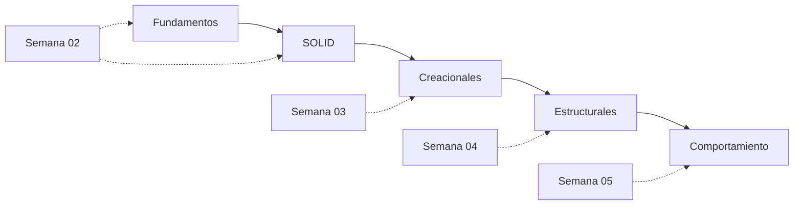

# Ejemplos prácticos de patrones de diseño y SOLID

[](https://www.typescriptlang.org/)
[](https://nodejs.org/)
[](./LICENSE)

Repositorio académico para **Análisis y Diseño de Sistemas 2 (ADS2)**. Contiene 22 ejemplos pequeños y ejecutables en TypeScript sobre fundamentos, principios SOLID y patrones de diseño creacionales, estructurales y de comportamiento. Las presentaciones de clase están disponibles en [`presentaciones/`](./presentaciones/).

## Comenzar en un minuto

Requisitos: Node.js 18 o superior y npm.

```bash
cd ejemplos
npm install
npm run check
npm run build
npm start
```

`npm start` ejecuta las 22 demostraciones en un orden didáctico. Para generar JavaScript en `ejemplos/dist/`, usa `npm run build`.

## Recorrido del material



El flujo parte de la inversión de control y la separación de responsabilidades, continúa con la creación y composición de objetos, y termina con sus formas de colaboración. El orden de `ejemplos/index.ts` sigue este recorrido.

## Catálogo de ejemplos

Cada fila enlaza directamente al código fuente. La columna “Riesgo” señala una decisión que conviene discutir en clase, no necesariamente un error del ejemplo.

| Categoría | Ejemplo | Problema | Razón para usarlo | Riesgo o pregunta para discutir |
| --- | --- | --- | --- | --- |
| Fundamentos | [Librería vs. framework](./ejemplos/fundamentos/libreria-vs-framework.ts) | Entender quién controla el flujo de ejecución. | Contrasta una llamada explícita con inversión de control. | ¿Cuánta autonomía conserva la aplicación? |
| SOLID | [SRP](./ejemplos/solid/srp.ts) | Una clase calcula, reporta y persiste a la vez. | Separa responsabilidades y razones para cambiar. | ¿Dónde termina cada responsabilidad? |
| SOLID | [OCP](./ejemplos/solid/ocp.ts) | La nómina debe admitir nuevos tipos de empleado. | Extiende mediante nuevas implementaciones sin editar el cálculo. | ¿La abstracción realmente representa las variaciones? |
| SOLID | [LSP](./ejemplos/solid/lsp.ts) | No todas las aves pueden volar. | Modela capacidades para mantener la sustitución válida. | ¿Qué contrato se rompería con una herencia incorrecta? |
| SOLID | [ISP](./ejemplos/solid/isp.ts) | Una interfaz grande obliga a implementar métodos innecesarios. | Divide el contrato por capacidades de cliente. | ¿Cuándo varias interfaces pequeñas se vuelven ruido? |
| SOLID | [DIP](./ejemplos/solid/dip.ts) | El servicio no debe depender de un repositorio concreto. | Inyecta una abstracción y permite cambiar el detalle. | ¿Quién compone las dependencias en una aplicación real? |
| Creacional | [Factory Method](./ejemplos/creacionales/factory-method.ts) | Crear notificaciones por canal sin acoplar el servicio. | Delega la creación a subclases especializadas. | ¿Cuándo una fábrica simple sería suficiente? |
| Creacional | [Abstract Factory](./ejemplos/creacionales/abstract-factory.ts) | Crear componentes de una misma familia sin mezclarlos. | Mantiene compatibles los productos relacionados. | ¿Cuánto crece la fábrica al agregar familias? |
| Creacional | [Singleton](./ejemplos/creacionales/singleton.ts) | Centralizar una configuración única. | Controla la creación de una instancia compartida. | ¿La unicidad es necesaria o introduce estado global? |
| Creacional | [Builder](./ejemplos/creacionales/builder.ts) | Construir un reporte con muchas opciones legibles. | Encadena pasos y valida el resultado al final. | ¿Cuándo conviene un objeto de opciones? |
| Creacional | [Prototype](./ejemplos/creacionales/prototype.ts) | Crear variantes a partir de una configuración validada. | Clona una base y copia su estado mutable. | ¿La copia es superficial o profunda? |
| Estructural | [Adapter](./ejemplos/estructurales/adapter.ts) | Conectar una interfaz nueva con una pasarela antigua. | Traduce el contrato sin modificar el código legado. | ¿Dónde deben vivir las conversiones y validaciones? |
| Estructural | [Proxy](./ejemplos/estructurales/proxy.ts) | Retrasar y controlar el acceso a un objeto pesado. | Conserva la misma interfaz y carga bajo demanda. | ¿Cómo se manejan errores, caché y concurrencia? |
| Estructural | [Facade](./ejemplos/estructurales/facade.ts) | Ocultar varios pasos de registro al cliente. | Expone una operación simple sobre un subsistema. | ¿La fachada se convierte en un objeto demasiado grande? |
| Estructural | [Decorator](./ejemplos/estructurales/decorator.ts) | Combinar extras sin crear una subclase por combinación. | Agrega comportamiento por composición en tiempo de ejecución. | ¿El orden de envoltura cambia el resultado? |
| Estructural | [Bridge](./ejemplos/estructurales/bridge.ts) | Hacer evolucionar notificaciones y canales por separado. | Separa la abstracción de su implementación. | ¿Qué dimensión debe variar de forma independiente? |
| Estructural | [Flyweight](./ejemplos/estructurales/flyweight.ts) | Muchos objetos repiten el mismo estilo. | Comparte el estado intrínseco y conserva la posición aparte. | ¿El ahorro de memoria compensa la complejidad? |
| Comportamiento | [Observer](./ejemplos/comportamiento/observer.ts) | Avisar a varios estudiantes cuando cambia un curso. | Desacopla al emisor de sus suscriptores. | ¿Quién cancela suscripciones y evita fugas? |
| Comportamiento | [Command](./ejemplos/comportamiento/command.ts) | Botones distintos deben ejecutar operaciones del portal. | Convierte una solicitud en un objeto intercambiable. | ¿Dónde se guardarían historial y deshacer? |
| Comportamiento | [Chain of Responsibility](./ejemplos/comportamiento/chain-of-responsibility.ts) | Encadenar validaciones que pueden detener una inscripción. | Distribuye el procesamiento entre pasos independientes. | ¿Qué ocurre si ningún eslabón procesa la solicitud? |
| Comportamiento | [Visitor](./ejemplos/comportamiento/visitor.ts) | Agregar reportes sin cambiar las clases de datos. | Separa operaciones de la estructura visitada. | ¿Qué costo tiene agregar un nuevo tipo de elemento? |
| Comportamiento | [Mediator](./ejemplos/comportamiento/mediator.ts) | Evitar que los controles de un formulario se conozcan entre sí. | Centraliza la coordinación de eventos. | ¿El mediador termina concentrando demasiada lógica? |

## Organización del repositorio

```text
ejemplos/
├── fundamentos/      # librerías, frameworks e inversión de control
├── solid/            # los cinco principios SOLID
├── creacionales/     # cómo se crean los objetos
├── estructurales/    # cómo se ensamblan los objetos
├── comportamiento/   # cómo colaboran los objetos
├── index.ts          # ejecuta las 22 demostraciones
├── package.json      # scripts y dependencia de TypeScript
├── tsconfig.json     # configuración del compilador
└── dist/             # salida generada; no se versiona

presentaciones/       # PDFs de las semanas 02 a 05
```

No se implementa Composite: aparece como referencia en la portada de la presentación estructural, pero no se desarrolla durante la clase.

## Presentaciones

Las presentaciones permanecen en PDF y siguen el orden cronológico del curso:

- [Semana 02 — Patrones de Diseño, SOLID, Frameworks y Librerías](<./presentaciones/Semana 02 — Patrones de Diseño, SOLID, Frameworks y Librerías.pdf>)
- [Semana 03 — Patrones de Diseño Creacionales](<./presentaciones/Semana 03 — Patrones de Diseño Creacionales.pdf>)
- [Semana 04 — Patrones de Diseño Estructurales](<./presentaciones/Semana 04 — Patrones de Diseño Estructurales.pdf>)
- [Semana 05 — Patrones de Diseño de Comportamiento](<./presentaciones/Semana 05 — Patrones de Diseño de Comportamiento.pdf>)

## Cómo estudiar un ejemplo

Para cada archivo, intenta responder en este orden:

1. **Problema:** ¿qué cambio, dependencia o colaboración resulta difícil?
2. **Patrón o principio:** ¿qué estructura propone el ejemplo?
3. **Razón:** ¿qué responsabilidad o variación queda aislada?
4. **Riesgo:** ¿qué complejidad, costo o abuso puede introducir la solución?

Después de leer el código, modifica un escenario de la función `demo...` y ejecuta de nuevo `npm start`. La implementación es deliberadamente pequeña para que las relaciones entre clases se puedan observar sin el ruido de una aplicación completa.

## Scripts y requisitos

Dentro de `ejemplos/` están disponibles:

| Comando | Propósito |
| --- | --- |
| `npm install` | Instala TypeScript. |
| `npm run check` | Comprueba tipos sin generar archivos. |
| `npm run build` | Compila los `.ts` en `dist/`. |
| `npm start` | Ejecuta `dist/index.js` y las 22 demostraciones. |

El proyecto usa npm, requiere Node.js 18 o superior y no necesita dependencias de ejecución externas. `node_modules/`, `dist/` y `.DS_Store` están excluidos mediante `.gitignore`.

## Salida esperada

La salida exacta puede variar si se modifica un ejemplo, pero comienza y termina con una secuencia similar a esta:

```text
ADS2 · demostraciones de patrones de diseño y SOLID

=== Librería vs. framework ===
La aplicación llamó a la librería: ANA
El framework inicia la aplicación.
...
=== Mediator ===
No se puede guardar: faltan datos.
El formulario habilitó horarios para ADS2.
Inscripción guardada: ADS2 - Jueves 17:20.
```

## Metadatos sugeridos para GitHub

El nombre actual del repositorio se conserva como `ejemplos_ayd2_ts`.

- **Descripción:** `Ejemplos prácticos en TypeScript sobre patrones de diseño y principios SOLID para Análisis y Diseño de Sistemas 2.`
- **Temas:** `typescript`, `design-patterns`, `solid`, `software-design`, `education`, `ads2`

## Licencia

Este material se distribuye bajo la [licencia MIT](./LICENSE).

> Refactoring.Guru puede servir como referencia conceptual para estudiar patrones. Los escenarios y el código de este repositorio están escritos para la clase y no son una copia literal de su contenido.
